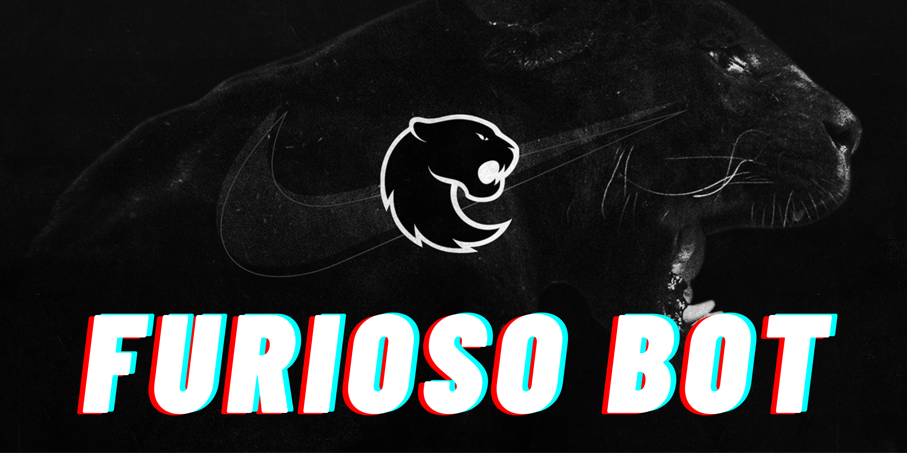

# 🦍 FURIOSO BOT

Bot do Telegram para acompanhar **próximos jogos** e **resultados recentes** da equipe de CS2 **FURIA**!

---

## 🚀 Como rodar

1. Clone o repositório:

    ```bash
    git clone https://github.com/seu-usuario/furioso-bot.git
    cd furioso-bot
    ```

2. Crie e ative um ambiente virtual:

    ```bash
    python3 -m venv venv
    source venv/bin/activate  # Linux / Mac
    venv\Scripts\activate     # Windows
    ```

3. Instale as dependências:

    ```bash
    pip install -r requirements.txt
    ```

4. Configure o arquivo `auth.py`:

    Crie uma pasta `config` com um arquivo chamado `auth.py` e adicione seu token do Telegram e token da API Pandascore:

    ```python
    # auth.py
    TOKEN = 'SEU_TOKEN_DO_TELEGRAM'
    PANDA_API_TOKEN = 'SEU_TOKEN_DA_API_PANDASCORE'
    ```

5. Rode o bot:

    ```bash
    python3 main.py
    ```

---

## 🛠 Tecnologias usadas

- [Python 3.12](https://www.python.org/)
- [python-telegram-bot](https://python-telegram-bot.org/)
- [Pandascore API](https://developers.pandascore.co/)
- [APScheduler](https://apscheduler.readthedocs.io/)
- [Requests](https://requests.readthedocs.io/)

---

## 🎯 Funcionalidades

- **Botões interativos** para fácil navegação entre todas as funções do bot.
- **Modo torcedor** uma experiência personalizada para quem vive e respira FURIA.
    - **Quiz interativo**: desafie seus conhecimentos sobre a FURIA e acumule pontos de torcedor raiz.
    - **Palpites dos jogos**: dê seu chute e veja se você manja mesmo de FURIA!
    - **Melhores momentos**: veja os melhores momentos da última partida.
- Exibir **line-up** da FURIA.
- Buscar **próximas partidas** da FURIA.
- Exibir **resultados recentes** da FURIA.
- Exibir **notícias** da FURIA.
- Exibir **história** da FURIA.
- Enviar **notificações inteligentes** para os torcedores da FURIA.
    - 2h, 1h, 30 min antes das partidas.
    - Alerta automático assim que a partida começar.
- **Integração com a API oficial de eSports** da Pandascore.
---

## 📷 Screenshots

> Quando o usuário digitar `/start`:

- Opções aparecem como botões:
  - 🎯 Próximos Jogos da FURIA
  - 🏆 Resultados Recentes
  - 📖 Nossa história
  - 🎯 Line-up da FURIA
  - 🔔 Ativar/Desativar notificações

---

Feito com ❤️ por **igorRamonDev**.
