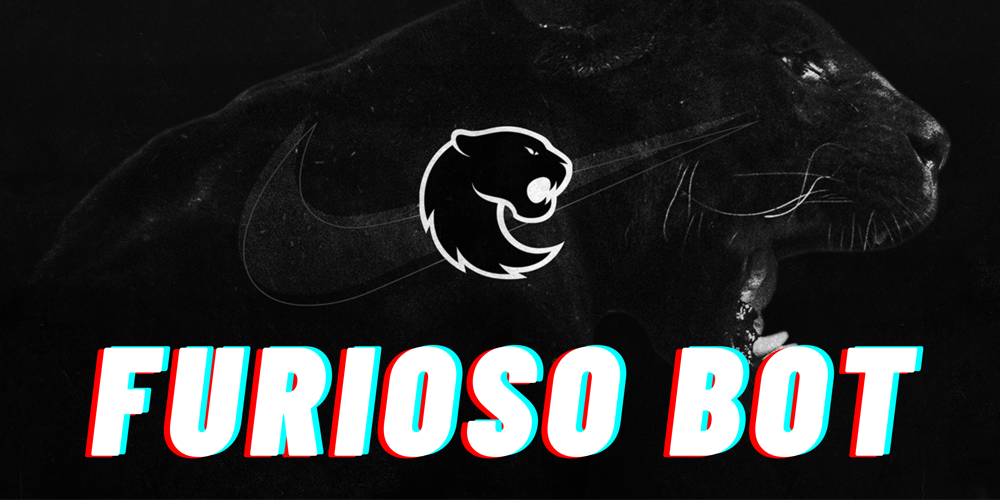

# 🦍 FURIOSO BOT

Bot do Telegram para acompanhar **próximos jogos** e **resultados recentes** da equipe de CS2 **FURIA**!

---

## 🚀 Como rodar

1. Clone o repositório:

    ```bash
    git clone https://github.com/seu-usuario/furioso-bot.git
    cd furioso-bot
    ```

2. Crie e ative um ambiente virtual:

    ```bash
    python3 -m venv venv
    source venv/bin/activate  # Linux / Mac
    venv\Scripts\activate     # Windows
    ```

3. Instale as dependências:

    ```bash
    pip install -r requirements.txt
    ```

4. Configure o arquivo `auth.py`:

    ```python
    # auth.py
    TOKEN = 'SEU_TOKEN_DO_TELEGRAM'
    PANDA_API_TOKEN = 'SEU_TOKEN_DA_API_PANDASCORE'
    ```

5. Rode o bot:

    ```bash
    python3 main.py
    ```

---

## 🛠 Tecnologias usadas

- [Python 3.12](https://www.python.org/)
- [python-telegram-bot](https://python-telegram-bot.org/)
- [Pandascore API](https://developers.pandascore.co/)

---

## 🎯 Funcionalidades

- **Botões interativos** no Telegram.
- Buscar **próximos jogos** da FURIA.
- Mostrar **resultados recentes** da FURIA.
- Integração com a **API oficial de eSports**.

---

## 📷 Screenshots

> Quando o usuário digitar `/start`:

- Opções aparecem como botões:
  - 🎯 Próximos Jogos da FURIA
  - 🏆 Resultados Recentes

---

Feito com  por igorRamonDev.
